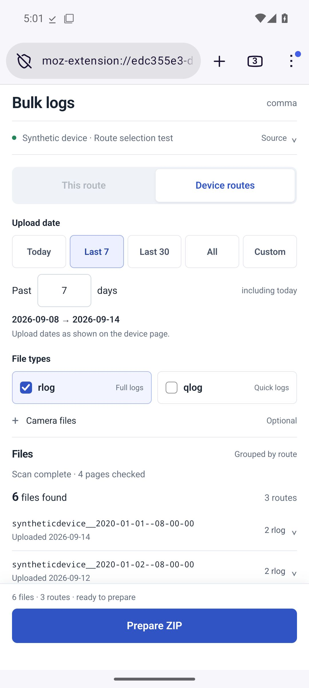
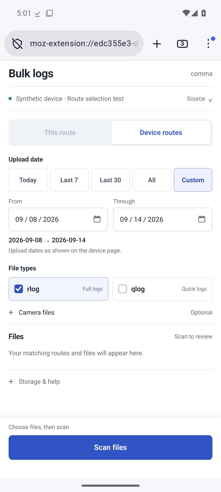
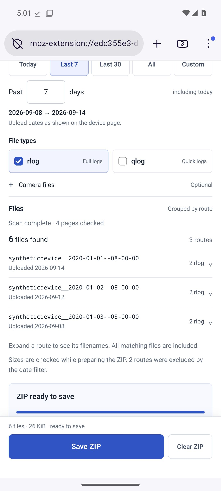

# Firefox Android: v0.2 validation

The Firefox extension uses a compact full browser tab to collect logs and
optional camera files into a ZIP. Version 0.2 restores all six original file
types and filters device routes by the **upload time** calendar date displayed
on the site.

[Download the unsigned v0.2 build](downloads/comma-firefox-0.2.0-unsigned.zip) ·
[Setup and selection guide](../firefox/README.md)

## Actual Android interface

These are screenshots from Firefox Nightly on an Android emulator, using
invented routes and file contents.

| Upload-date selection | Custom dates | Ready to save |
| --- | --- | --- |
|  |  |  |

The layout keeps the next action visible while the controls and grouped route
results scroll together. Camera choices, filenames and supplementary help are
expandable. The footer participates in the page layout: this fixes an observed
Firefox Android accessibility issue with fixed buttons when the toolbar
retracts. Scrolling is contained to avoid pull-to-refresh discarding a scan.

## Environment and evidence

The passing test uses Firefox Nightly **158.0a1** on an Android **15 / API 35**
x86_64 Pixel emulator. It temporarily installs a test extension containing the
production archive engine, parser, downloader HTML, CSS and handlers. A test-only
browser API adapter supplies synthetic page snapshots and file responses. The
fixture manifest disallows network requests.

The tested source commit is
`af6a2d9086c1ea14e6ebb1a2a8313662391dccc5`.
[The passing Actions run](https://github.com/zappybiby/bulk-log-downloader-for-comma/actions/runs/34871702020)
contains the execution status and synthetic diagnostics. A compact
[verification report](firefox-android-results.json) preserves the archive hashes
and results. The screenshots and
build linked here are also preserved in this repository. Documentation and
artifact-only commits after the tested commit do not change production code.

Uploaded private page captures were inspected locally. They are absent from
the repository, test fixtures, CI, screenshots and distributable.

## Date selection and native ZIP save

The synthetic device has five routes uploaded today and 2, 6, 8 and 31 days ago.
Their recording dates and route timestamp IDs are deliberately unrelated dates
in 2020.

- **Today** matched one route and two rlogs.
- **Last 7** matched three routes and six rlogs, including today and the previous
  six calendar dates. The interface displayed the exact inclusive date range.
- Android automation used the production Scan, Prepare ZIP and Save ZIP controls,
  accepted Firefox's native download prompt, then pulled the saved ZIP from
  Android Downloads.
- Python's independent ZIP reader confirmed exactly the six expected paths,
  every payload byte and every CRC. Neither older route was included. The
  verified selection ZIP was **26,254 bytes**.
- Custom From/Through controls and all four camera options were displayed and
  inspected on Android. Numerical custom ranges and selection of all six file
  types are covered by local tests.

The filter uses upload time, matching the original extension's date source.
Recording start/end times, creation dates, firmware dates and timestamp route
IDs do not determine the selection. Dates remain calendar dates as shown on the
site, which does not declare a timezone for that column. Today follows the
phone's calendar. Custom ranges include both endpoints; All includes undated
routes. The original past-7 calculation covered eight calendar dates; this
version explicitly includes seven and displays the bounds.

## Archive checks

| Payload | Files | Storage | Verification |
| --- | ---: | --- | --- |
| 7.5 MiB | 120 | Browser temporary disk (OPFS) | Native save, every entry, byte and CRC checked |
| 30 MiB | 120 | Browser temporary disk (OPFS) | Native save, every entry, byte and CRC checked |
| 60 MiB | 120 | Browser temporary disk (OPFS) | Native save, every entry, byte and CRC checked |

Cancellation and an HTTP 503 response were also exercised without offering a
successful partial archive.

The local suite passes **57 parser, bridge, archive and UI tests**. These cover
inclusive custom ranges, arbitrary day counts, all file types, unrelated
recording dates, timezone and daylight-saving boundaries, source navigation,
pagination, cancellation and failure handling. A tab left open overnight
shows the exact range captured by its next scan, even if that scan crosses
midnight. Extension linting reports no errors, warnings or notices.

The packaged build contains only the 12 explicitly allowed production files
and extension documentation, with no fixtures or captures. SHA-256:
`a47f09c94c8cf109811802cc36c0803f0c93647c4208b4809e3b8512efa732ac`.

## Limits

The build is **unsigned**; ordinary phone installation requires Mozilla signing.
The emulator run does not validate live account authentication, live signed
URLs, background operation, screen-off behavior or other phone hardware.

The 256 MiB default archive limit is a protective ceiling, not a verified
capacity on every phone. The largest verified payload is 60 MiB. Browser
temporary storage can fall back to a 32 MiB memory limit. Already-compressed
logs and camera files are stored in the ZIP without recompression.

[Reproduction instructions](../tests/android/README.md) describe the emulator
setup and the boundary between production code and the synthetic adapter.
