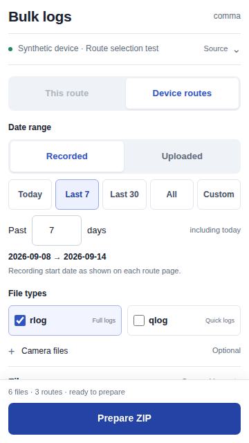
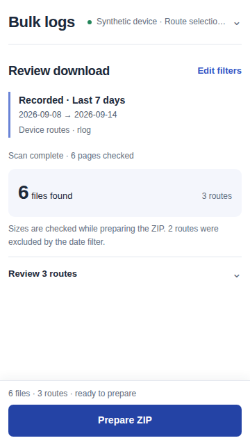
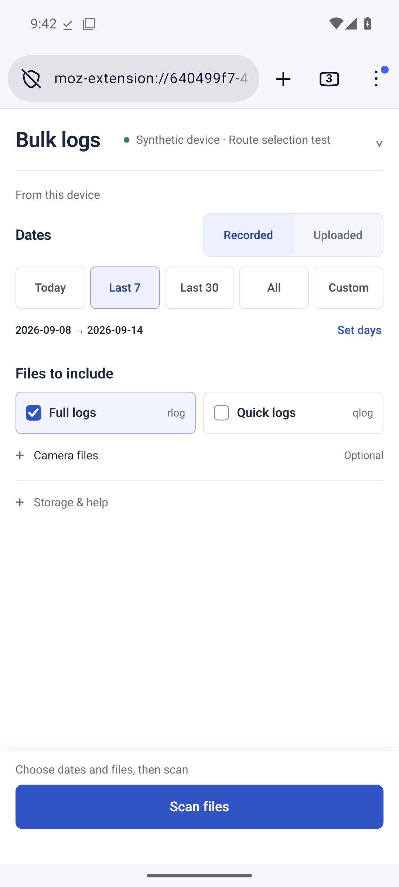
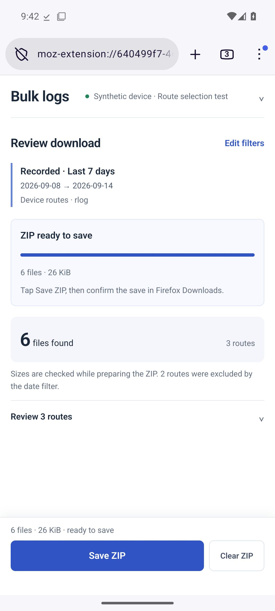

# Firefox Android: compact download flow

Version 0.4 separates choosing files from reviewing a download. Common controls
fit together without placing a long route list below the filters.

- **Choose:** Recorded / Uploaded, date presets, and Full logs / Quick logs.
  Set days, Custom, Camera files, and Storage & help expand when needed.
- **Review:** exact dates, selected types, file and route counts, then Prepare ZIP.
  Edit filters returns to setup. Back to results preserves the selection and ZIP
  until a setting actually changes.
- **Save:** preparation and save status stay above optional route details. The
  bottom action bar keeps the next action available.
- **Route details:** dates lead each row. Reveal ten more routes at a time;
  keyboard focus follows the newly revealed entries. All matching files remain
  included in the archive.

The source lives in a compact header disclosure. On device pages, the redundant
route-scope switch is replaced with “From this device.” Route pages retain the
This route / Device routes choice when both are available.

Recording-date semantics, four shared fresh page readers, and ZIP limits are
unchanged. No recording-date cache is introduced.

## Verification

The behavioral suite passes **87 tests**, including Edit / Back retention,
unchanged preset selection, custom ranges, cancellation, errors, and a 25-route
review whose ZIP still includes all 25 routes. Firefox extension lint reports
zero errors, warnings, or notices.

The browser layout probe compares version 0.3 with the current production UI,
using invented routes and blocked HTTP requests. It checks 320, 360, and 390 CSS
pixel widths, plus a 320-pixel view with text doubled. Its viewport excludes the
native browser toolbar; separate Android evidence covers Firefox itself.

[The passing layout run](https://github.com/zappybiby/bulk-log-downloader-for-comma/actions/runs/34899885821)
captured 28 before/after states on commit
`5f8aab1407c6a78432317e5093b5cf4488cc8b78`. All 16 current-UI states passed the
checks for horizontal overflow, clipped control text, 44-pixel targets, and an
on-screen primary action. See [raw geometry](firefox-compact-layout.json).

| At 360 × 640 CSS pixels | Version 0.3 scrollable content / available height | Version 0.4 |
| --- | ---: | ---: |
| Choose filters | 675 / 548 px | 547 / 547 px |
| Review files | 955 / 548 px | 547 / 547 px |

| Review before | Review after |
| --- | --- |
|  |  |

The common choose and review views therefore need no scrolling in this layout
probe. Optional expanded sections and large text can still require vertical
scrolling. Text doubling is a layout stress check, not an Android system-font
setting or a TalkBack audit.

[The Firefox Nightly Android run also passed](https://github.com/zappybiby/bulk-log-downloader-for-comma/actions/runs/34899885851)
on the same source commit. The native UI checks require the main setup controls,
review counts, and next action to fit together inside Firefox's actual WebView,
without helper scrolling or footer obstruction. Edit / Back preserves both the
file selection and prepared ZIP. The run also verifies both Recorded and Uploaded
native ZIP saves, a fresh recording-date rescan, cancellation, HTTP failure,
and 120-file archives at 7.5, 30, and 60 MiB.

| Firefox Android setup | Firefox Android ZIP ready |
| --- | --- |
|  |  |

See [device, archive, and accessibility-bound evidence](firefox-compact-verification.json).

All remote tests use invented data. Private page captures are excluded from
fixtures, screenshots, workflow artifacts, and extension packages. Live account
authentication and background downloads remain untested.

## Build

The source and package are unsigned. Ordinary Firefox installation requires
Mozilla signing. See [development installation](../firefox/README.md#development-installation)
and the [prototype limits](../firefox/README.md#limits-of-this-prototype).

[Download unsigned version 0.4.0](downloads/comma-firefox-0.4.0-unsigned.zip).
The archive contains 13 allowlisted extension files; every entry was compared
byte-for-byte with the source, and the ZIP integrity check passed.

SHA-256: `5f1bca3d0ba6b1902d2fb454b9052ae515c87dd663881fc0121b37d43dd29893`
