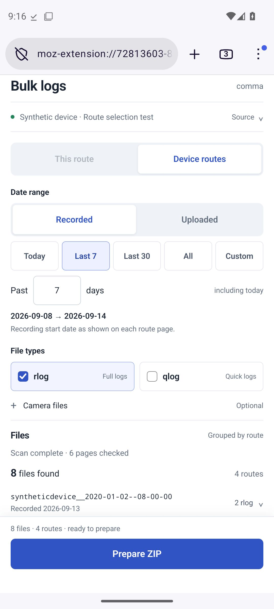

# Firefox v0.3: parallel reading, fresh recording dates

This version implements four parallel page readers without a recording-date
cache. Every scan requests current pages with `cache: "no-store"`; preferences
are saved, but recording metadata and signed file addresses are not reused
between scans. Archive payload downloads remain separate from page discovery.

## What changed

- **Recorded** filters the displayed `start_time` calendar date in the route
  metadata table. **Uploaded** preserves the original device-list date filter.
- New installations default to Recorded. Saved v0.2 choices keep their upload-date
  meaning until the user changes the date selector.
- Recording-date scans read every unique route listed by the device, regardless
  of its upload date. Rejected routes skip file-link enumeration.
- Route-list and detail requests share four slots. Later listing pages load
  while already-discovered routes are checked. No early-body parsing, bulk API
  login or recording-date cache is included.
- Separate limits allow up to 100 listing pages, 5,000 routes and 10,000 selected
  files. A listing/route limit requires a smaller device list or a single route;
  a narrower recording-date range cannot avoid reading the whole catalog.
- Stop, a failed page, a pagination loop or a limit discards the partial selection
  and cancels active reads. No partial scan is offered for ZIP preparation.

Dates retain the calendar shown on the site; no timezone is inferred. A drive
crossing midnight is selected by its start date. Missing, invalid or ambiguous
recording dates are counted and excluded by a date range; All includes them.
Upload time, route-name timestamps, create time and end time never substitute
for a missing recording start.

## Verification

All 82 automated tests pass, and Firefox extension lint reports no errors,
warnings or notices.

The production scanner's 1,000-route test performs 1,020 fresh reads across 20
listing pages, reaches exactly four simultaneous reads with listing/detail
overlap, and selects the expected 112 routes and 224 rlogs. The test deliberately
uses upload dates that disagree with recording dates. Its invented reader is a
correctness/concurrency test, not a live-service speed estimate.

Other tests cover a corrected previously-excluded recording date on the next
scan, fresh signed file addresses, unknown dates, duplicate route rows, listing
loops, source navigation, concurrent cancellation/503 failures, scan limits,
date-basis changes, preference migration and archive integrity.

The parser accepted both route-detail examples in a local-only check of the four
private page captures. Only aggregate success counts were printed; captures and
their identifiers are not part of the source, test fixtures or package.

Android validation uses production HTML, CSS, parser, scanner and handlers with
an invented page-reader adapter. Recorded and Uploaded select different sets
of routes. The harness saves a ZIP for each and independently verifies exact
paths, bytes and CRCs. A second Recorded scan must discover a deliberate
synthetic recording-date correction. This does not test authenticated useradmin
requests or real HTTP cache behavior.

The first emulator attempts saved correct selected ZIPs but later timed out
because a native Firefox download notification covered the Scan button during
the next test-driver tap. The harness now waits for that observed native overlay
to disappear and verifies that a scan actually starts. This correction changes
only the Android test driver.

The corrected [Firefox Nightly Android push run](https://github.com/zappybiby/bulk-log-downloader-for-comma/actions/runs/34897384147)
passed at commit `cc7e333a537392dc79d0722dfd1c0a599743fec8`.
The extension source is identical to `ded5f2d5a962dd1807691f730baa41f1bfc0a0b1`;
the later commit changes only the test driver.

| Native Android check | Verified result |
| --- | --- |
| Recorded, Last 7 | 3 routes / 6 rlogs; route indices 1, 3, 4 |
| Uploaded, Last 7 | 3 routes / 6 rlogs; indices 0, 1, 2 |
| Recorded after upstream date correction | 4 routes / 8 rlogs; formerly excluded route included |
| Archive workloads | 120 files each at 7.5, 30 and 60 MiB; exact paths, bytes and CRCs |

Native saves and the corrected-date UI flow ran on Firefox Nightly 158.0a1,
Android 15 x86_64. The two selected ZIPs were independently byte-verified;
the corrected-date rescan checks the final UI counts. The emulator's page
responses and downloads were synthetic, with no account access.

[Saved validation evidence](firefox-parallel-verification.json)

## Package and remaining limits

[Unsigned v0.3.0 ZIP](downloads/comma-firefox-0.3.0-unsigned.zip).
SHA-256: `94111b800feac54afb1ad2bccd08c665fab08739d3915184d8ad0773f5092ddd`.
The ZIP contains exactly the corresponding extension source files.
Mozilla signing is still required for ordinary installation. The archive cap
remains 256 MiB with temporary disk storage, or 32 MiB with the memory fallback.

Real server latency, rate limits, signed-link expiry, account permissions and
Android background suspension remain unverified. Four readers are the initial
bounded setting, not a claim of optimal throughput on every phone or connection.
The scanner cannot establish that a changing offset-paginated upstream list is
a consistent snapshot or detect records the website never exposes.

See the [usage instructions](../firefox/README.md),
[earlier performance experiments](recording-date-investigation.md) and
[scanner regression tests](../tests/scanner.test.cjs).
