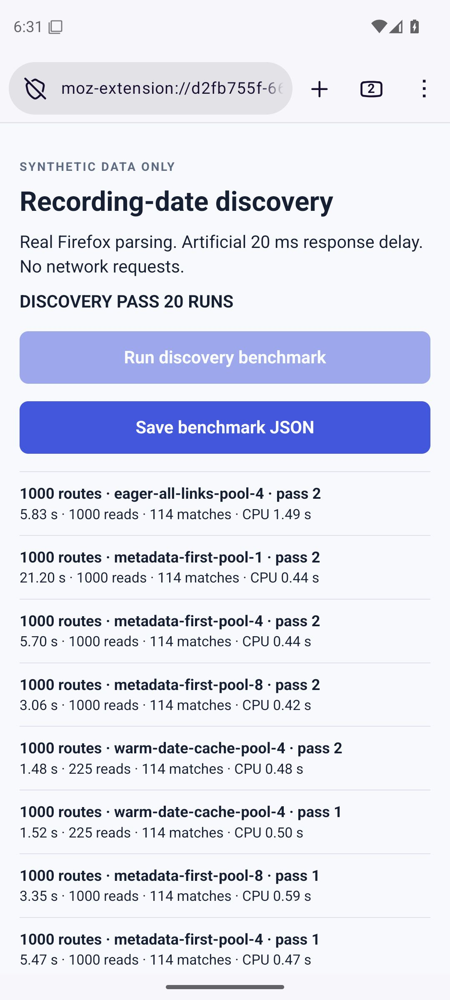

# Recording-date discovery: further investigation

**Implementation update:** [Firefox v0.3](firefox-parallel-reading.md) now uses four
parallel fresh readers with recording-date filtering and separate scan limits.
Caching, early-body parsing and a bulk provider remain unshipped experiments.
The measurements and recommendations below preserve the earlier investigation.

The strongest design is a layered reader: reuse checked metadata, overlap route
listing and detail requests within one small request budget, and inspect metadata
before enumerating file links. Reading only the beginning of rejected pages could
save additional transfer work. A bulk API can help when its dates and access are
validated, with explicit fallback for incomplete metadata.

This is investigation code. The v0.2 installation package has not changed.
All fixtures are invented; private page captures remain local.

## Early response exit can save bytes, conditionally

The route-detail page structure examined locally places recording metadata before
the long file list. An experimental streaming HTML tokenizer reads that table. If
it obtains a valid out-of-range date, it cancels the remaining response body. A
matching route keeps the entire response for file discovery; ambiguous metadata
falls back to reading and parsing the full page.

Each local case used 30 invented routes, 10% matching, one request at a time and
artificial chunk pacing. The compressed cases use actual gzip encoding. Both
strategies selected exactly the same three routes:

| Local response case | Full read | Early-reading prototype | Fewer response bytes |
| --- | ---: | ---: | ---: |
| 18 KiB, paced, metadata first | 0.52 s | 0.10 s | 56.6% |
| 256 KiB, paced, metadata first | 5.28 s | 0.65 s | 87.5% |
| 256 KiB before gzip, paced, metadata first | 2.40 s | 0.36 s | 82.8% |
| 18 KiB before gzip, fully buffered | 0.10 s | 0.07 s | 0.0% |
| 256 KiB, metadata last | 4.98 s | 4.35 s | 0.0% |

These are localhost measurements. Byte counts are application bytes written by
the test HTTP server, compressed where stated, with response settlement observed
before finalizing counts. They exclude transport overhead. Early cancellation
cannot reclaim bytes already sent or buffered. Its value depends on the real
server's buffering, compression and metadata placement; no claim of equivalent
savings on comma's servers is established.

Thirty-two parser checks cover chunk boundaries, entities, comments, script
lookalikes, invalid dates, duplicate fields and missing metadata. This narrow
htmlparser2 prototype is not a validated HTML5-parser replacement. Before use in
Firefox it needs a bundled parser, strict recognition/fallback, malformed-table
coverage, and browser-level stream-cancellation tests. The streaming and parallel
approaches were measured separately, so their speedups must not be multiplied.

[Streaming source](../bench/recording-discovery/streaming-benchmark.cjs) ·
[Raw measurements](../bench/recording-discovery/streaming-results.json)

## Bulk API: use available metadata without trusting omissions

A stronger alternative emerged from public-source and adversarial contract tests:
join API rows to the complete useradmin route list, use only validated dates, and
inspect missing or ambiguous IDs individually. Broad metadata can identify known
nonmatches; a narrow matching-only response cannot safely exclude every missing
route when the API's completeness contract is unverified.

With 1,000 invented routes, all three plans found the same 224 matching drives:

| API metadata available | HTML detail reads needed |
| --- | ---: |
| Complete broad metadata | 224 |
| Only matching rows, completeness unknown | 1,000 |
| 250 rows, including 25 ambiguous rows | 825 |

These counts exclude listing reads, API requests and file downloads. Selected
routes still need current download links. Plausible but incorrect API dates can
still cause incorrect exclusions: date meaning, timezone and freshness must be
validated before this provider is used for filtering.

Connect's public client increases limits cumulatively rather than using a cursor.
Offline tests demonstrate how silent caps, shared boundary timestamps or unknown
window predicates can make seemingly efficient pagination incomplete. The safer
join design has a fallback for missing records. Authentication is still a
separate, unverified integration with the current useradmin workflow.

See the [bulk contract report and pinned primary sources](recording-bulk-contract.md)
and [nine offline contract scenarios](../bench/recording-discovery/bulk-contract-results.json).

## Pipelining mainly improves the first visible result

The local scheduler starts detail reads while discovering later listing pages.
Both approaches share the same four-request budget, including listing requests;
there is no extra fifth request. Three alternating-order repetitions were run
for 500/1,000 routes, two page sizes and cold/warm cache conditions.

| 1,000 routes, 50 per page | Staged total | Pipelined total | First match: staged → pipelined | Requests |
| --- | ---: | ---: | --- | ---: |
| First scan | 7.257 s | 6.956 s | 434 → 83 ms | 1,020 |
| Mostly cached | 1.861 s | 1.718 s | 405 → 41 ms | 245 |

All 48 timing rows passed route/file-selection, request-count and concurrency
assertions. Total-time gains were modest and inconsistent with the hypothetical
200-row pages; the real site is not established to support that page size.
The loopback HTTP server and client parser share one Node event loop, so these
are scheduling experiments rather than phone/server forecasts.

Duplicate routes and an entirely repeated listing page were handled without
prematurely ending enumeration. This does not prove completeness for a changing
offset-paginated list: an upstream snapshot/cursor guarantee is still absent.
Cancellation and HTTP 503 cases stopped all queued work, aborted outstanding
requests and observed client/server settlement. They never treated partial
results as complete.

A separate cache case deliberately corrected an out-of-range recording date into
the chosen range. The fresh-looking cache missed one match; full refresh found it.
Therefore a fast cached scan needs clear freshness semantics and a full-refresh
option. Rechecking only previously selected routes cannot discover corrections
to dates that the cache excluded. Strong freshness requires revalidation or
trustworthy upstream revision markers, which have not been established here.

The result file transparently identifies timing rows recovered from first-run
logs after a later fault-test assertion failed. Unrecorded fields are omitted.
Fault cases were rerun successfully with observed response settlement; the script
now checkpoints each passing timing row.

[Pipeline source](../bench/recording-discovery/pipeline-benchmark.cjs) ·
[Timing and fault results](../bench/recording-discovery/pipeline-results.json)

## Native Firefox Android benchmark

The [dedicated Android run](https://github.com/zappybiby/bulk-log-downloader-for-comma/actions/runs/34880779562)
passed all **20 measured runs** on Firefox Nightly 158.0a1, Android 15 x86_64,
with two logical cores. Each strategy ran twice in reversed order, at 300 and
1,000 routes, after parser warmup. The report was saved through Firefox's native
download flow and independently checked in Python for exact selected
route/segment digests, read counts and concurrency bounds.

The browser uses actual DOMParser and the existing file parser. Responses are
invented in-memory HTML made available after an artificial 20 ms delay. There is
**no networking**, bandwidth limit, server load, listing pagination or
extension-message serialization in this benchmark. These are browser timings
for a synthetic workload, not live-service scan estimates. Two-pass medians:

| Strategy | 1,000-route wall time | Simulated detail reads | Parse/enumeration elapsed time |
| --- | ---: | ---: | ---: |
| Inspect files on every route, 4 workers | 5.79 s | 1,000 | 1.454 s |
| Metadata first, 1 worker | 21.08 s | 1,000 | 0.445 s |
| Metadata first, 4 workers | 5.59 s | 1,000 | 0.457 s |
| Metadata first, 8 workers | 3.21 s | 1,000 | 0.504 s |
| Warm date cache, 4 workers | 1.50 s | 225 | 0.490 s |

Every 1,000-route strategy selected the same 114 routes and 2,280 rlogs. At 300
routes, each selected the same 34 routes and 680 rlogs. Both eager and deferred
file enumeration requested only rlogs, making this a same-file-type comparison.
The current production snapshot actually enumerates all six available types
before filtering; these measurements do not claim to time that entire snapshot.

Checking metadata before enumerating rejected routes reduced accumulated
synchronous parsing/enumeration elapsed time by about **69%** at four workers,
but total cold-scan wall time fell only **3.6%**. Artificial response waiting
largely dominates this workload. The JSON field `totalMeasuredParseCpuMs` and
screenshot label “CPU” refer to performance.now intervals, **not profiled CPU
time**; they can include garbage collection and scheduling pauses.

Eight workers were faster in this unthrottled fixture, but their heartbeat-lag
95th percentiles were 35/26 ms versus 8/9 ms with four. The cached four-worker
runs also had variable lag (32/27 ms). This is an event-loop proxy, not measured
Android frame timing or proof of a universally optimal worker count.

[Raw browser results](../bench/recording-discovery/android-results.json) ·
[Independent verification and provenance](../bench/recording-discovery/android-verification.json)



## Design recommendation after this round

Use a bounded, pipelined metadata reader with explicit cache refresh. Read each
route once, determine its recording date first, and enumerate requested files
only when it matches. Four workers remain a sensible initial setting to measure
against live response behavior; adaptive tuning has not yet been tested.

Treat early-body exit as a promising second step, conditional on strict HTML
recognition and actual Firefox/network cancellation behavior. It can reduce
bytes while still refreshing dates, but cannot eliminate per-route request
latency or work the server already performed. Keep a full-parser fallback.

A broad bulk API catalog can become another provider when login, timestamps and
permissions are verified. Join by known route IDs and inspect omissions. Cached
exclusions require clear freshness limits; a full refresh is needed to find
arbitrary upstream date corrections when no revision marker is available.

The existing combined 100-page guard also needs replacement before the shipped
scanner can support this scale. These prototypes deliberately test beyond that
guard; they have not silently raised the production limits. The combined reader,
streaming path and bulk provider have not been integrated into the extension.

## Reproduce the new experiments

```sh
node bench/recording-discovery/streaming-benchmark.cjs > bench/recording-discovery/streaming-results.json
node bench/recording-discovery/pipeline-benchmark.cjs
node bench/recording-discovery/bulk-contract.cjs > bench/recording-discovery/bulk-contract-results.json
```

The pipeline script checkpoints its measured rows and has a `--faults-only` mode.
The Android experiment uses the dedicated Firefox Android recording discovery
benchmark workflow; it does not run the archive-size workloads.

The previous [performance report](recording-date-performance.md) preserves the
first-stage localhost and network-model results. Neither investigation has made
live account requests or downloaded real logs.
